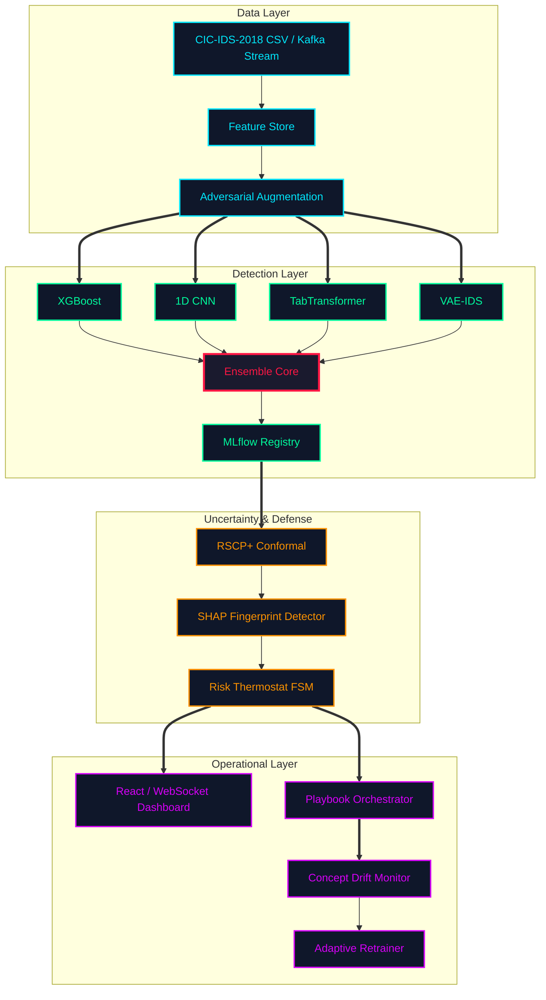

# Adversarially Resilient Detection Pipelines (ARDP)

A self-healing Security Operations Center (SOC) pipeline that combines adversarial
training, certified conformal prediction, SHAP-based adversarial detection, and
adaptive concept-drift handling to maintain robust, explainable intrusion detection
under active adversarial pressure.

Live dashboard: **http://107.22.150.51/**

---

## Architecture



---

## Quick Start

```bash
# 1. Install Python dependencies
pip install -r requirements.txt

# 2. Run in demo mode (synthetic data, no CSV required)
python main_pipeline.py --mode demo

# 3. Launch the SOC dashboard (dev)
cd dashboard && npm install && npm run dev
# Dashboard: http://localhost:5173
# API docs:  http://localhost:8000/docs
```

---

## Installation

### Requirements
- Python 3.10+
- Node.js 18+ (dashboard only)

### Local (pip)

```bash
python -m venv .venv
source .venv/bin/activate        # Windows: .venv\Scripts\activate
pip install -r requirements.txt
```

### Docker — development stack

```bash
docker compose up --build
# api:8000  dashboard:5173  redis:6379
```

### Docker — production (EC2)

```bash
docker compose \
  -f infrastructure/aws/docker-compose.prod.yml \
  up -d --build
# nginx:80 (reverse proxy)  api:8000  redis:6379
```

---

## Usage

### Pipeline modes

```bash
# Live batch inference on CIC-IDS-2018
python main_pipeline.py --mode batch --data data/raw/02-14-2018.csv

# Streaming inference (Kafka)
python main_pipeline.py --mode streaming

# Demo / simulation (synthetic traffic, no CSV)
python main_pipeline.py --mode demo

# Simulate attack + defense loop via API
curl -X POST http://localhost:8000/api/simulate \
     -H 'Content-Type: application/json' \
     -d '{"attack_type":"pgd","n_samples":100}'
```

### Experiments

```bash
python experiments/benchmark_suite.py       # full robustness benchmark
python experiments/ablation_study.py        # component ablation
python experiments/baseline_comparison.py   # vs. baselines
python experiments/robustness_curves.py     # generate plots
```

### Tests

```bash
pytest tests/ -v --tb=short
# 94 passed, 8 skipped (TF absent)
```

---

## Project Structure

```
Adversarially-resilient-detection-pipelines/
├── .github/workflows/
│   ├── ci.yml                      # lint + test on every push
│   └── cd.yml                      # deploy to EC2 after CI passes
├── configs/
│   ├── default.yaml
│   ├── experiment.yaml
│   ├── attack_sweep.yaml
│   ├── production.yaml
│   └── prometheus.yml
├── dashboard/                       # React + Vite SOC dashboard
│   ├── src/
│   │   ├── App.jsx
│   │   ├── components/
│   │   │   ├── AlertFeed.jsx        # paginated live alert list
│   │   │   ├── AttackSimulator.jsx  # trigger attacks from UI
│   │   │   ├── ConformalViz.jsx     # prediction set visualization
│   │   │   ├── DriftIndicator.jsx   # drift detector state
│   │   │   ├── ExplainPanel.jsx     # SHAP waterfall per alert
│   │   │   ├── Header.jsx
│   │   │   ├── ModelPerformance.jsx # accuracy / F1 chart
│   │   │   ├── PlaybookPanel.jsx    # active playbook steps
│   │   │   ├── RiskThermometer.jsx  # FSM risk score gauge
│   │   │   ├── ThreatMap.jsx        # D3 particle flow map
│   │   │   └── UncertaintyGauge.jsx # CP set-size gauge
│   │   ├── hooks/
│   │   │   ├── useAlerts.js
│   │   │   └── useWebSocket.js
│   │   ├── services/api.js
│   │   └── utils/
│   │       ├── chartConfig.js
│   │       └── theme.js
│   └── dist/                        # pre-built, served by nginx
├── data/
│   ├── raw/02-14-2018.csv           # CIC-IDS-2018 (place here)
│   └── processed/
├── docs/
│   ├── api_reference.md
│   ├── architecture.md
│   ├── attack_catalog.md
│   ├── contributing.md
│   ├── deployment_guide.md
│   └── threat_model.md
├── experiments/
│   ├── benchmark_suite.py
│   ├── robustness_curves.py
│   ├── ablation_study.py
│   └── baseline_comparison.py
├── infrastructure/aws/
│   ├── docker-compose.prod.yml      # nginx + api + redis
│   ├── nginx.conf
│   ├── ec2_userdata.sh
│   ├── deploy.sh
│   └── terraform/
├── paper/
│   ├── main.tex
│   ├── references.bib
│   ├── figures/
│   └── tables/
├── src/
│   ├── api/
│   │   ├── server.py                # FastAPI app + all routes
│   │   └── websocket_manager.py     # WebSocket broadcast
│   ├── attacks/
│   │   ├── white_box.py             # PGD (l2/linf), C&W L2, AutoAttack
│   │   ├── black_box.py             # Boundary, HopSkipJump, transfer
│   │   ├── physical.py              # feature-constrained, SlowDrip, mimicry
│   │   ├── poisoning.py             # label-flip, backdoor, clean-label
│   │   └── gan_adversary.py         # WGAN-GP flow generator
│   ├── conformal/
│   │   ├── rscp.py                  # RSCP+ with PTT (main defense)
│   │   ├── multi_class_cp.py        # RAPS / APS multi-class
│   │   ├── online_cp.py             # sliding-window online CP
│   │   └── poison_defense.py        # conformal poison detection
│   ├── drift/
│   │   ├── drift_detector.py        # ADWIN, Page-Hinkley, MMD consensus
│   │   └── adaptive_retrainer.py    # trigger + execute retraining
│   ├── explainability/
│   │   ├── shap_engine.py           # TreeSHAP / DeepSHAP / KernelSHAP
│   │   ├── lime_engine.py           # LIME surrogate explainer
│   │   ├── adversarial_detector.py  # SHAP fingerprint + GMM + sensitivity
│   │   └── report_generator.py      # JSON / HTML / CSV incident reports
│   ├── mlops/
│   │   ├── experiment_tracker.py    # MLflow run tracking
│   │   ├── model_registry.py        # champion/challenger registry
│   │   ├── monitoring.py            # Prometheus metrics
│   │   └── data_versioning.py       # dataset hash + lineage
│   ├── models/
│   │   ├── deep_ensemble.py         # XGBoost + 1D-CNN + TabTransformer + VAE
│   │   ├── tab_transformer.py       # pure-NumPy TabTransformer
│   │   ├── variational_autoencoder.py  # VAE anomaly detector
│   │   ├── adversarial_trainer.py   # TRADES / PGD-AT / Free-AT
│   │   └── calibration.py           # temperature + Platt scaling
│   ├── streaming/
│   │   ├── kafka_consumer.py
│   │   ├── kafka_producer.py
│   │   ├── feature_store.py         # Redis-backed rolling feature store
│   │   └── inference_service.py     # end-to-end streaming inference
│   ├── data_infrastructure.py       # CSV load, preprocess, train/cal/test split
│   ├── detection_ensemble.py        # ensemble wrapper
│   ├── risk_management_engine.py    # FSM thermostat + playbook orchestrator
│   └── utils.py
├── tests/
│   ├── test_attacks.py
│   ├── test_conformal.py
│   ├── test_explainability.py
│   ├── test_integration.py
│   ├── test_models.py
│   └── test_streaming.py
├── main_pipeline.py                 # CLI entry point
├── simulation_engine.py             # synthetic traffic generator
├── docker-compose.yml               # dev compose
├── Dockerfile
├── requirements.txt                 # full dependencies
├── requirements-ci.txt              # pinned CI dependencies
└── requirements-prod.txt            # production dependencies
```

---

## API Reference

Base URL: `http://<host>/api`  (proxied by nginx in production)

| Method | Endpoint | Description |
|--------|----------|-------------|
| GET | `/api/status` | Pipeline health, model state, SOC FSM state |
| GET | `/api/alerts` | Recent alerts (supports `?limit=N&filter=threats\|high`) |
| GET | `/api/metrics` | Live accuracy, F1, threat rate, latency |
| GET | `/api/metrics/history` | Rolling metrics timeseries |
| GET | `/api/explain/{alert_id}` | SHAP waterfall + top features for a specific alert |
| POST | `/api/simulate` | Start an attack simulation run |
| POST | `/api/simulate/stop` | Stop running simulation |
| GET | `/api/simulate/status` | Simulation run state |
| POST | `/api/demo/start` | Start synthetic demo mode |
| POST | `/api/demo/stop` | Stop demo mode |
| GET | `/api/demo/status` | Demo mode state |
| GET | `/api/connections` | Active WebSocket connections |
| WebSocket | `/ws/live` | Real-time alert + metric stream |

Full reference: [docs/api_reference.md](docs/api_reference.md)

---

## Attack Library

| Category | Attacks | Notes |
|----------|---------|-------|
| White-box | PGD (ℓ₂, ℓ∞), C&W L2, AutoAttack | Full gradient access |
| Black-box | Boundary Attack, HopSkipJump, Transfer | Score / decision access |
| Physical | Feature-Constrained Evasion, SlowDrip, Mimicry | Network-level constraints |
| Poisoning | Label Flip, Backdoor, Clean-Label, Calibration Poison | Training-time |
| Generative | WGAN-GP adversarial flow generator | Distribution-level evasion |

---

## Defense Components

| Component | Method | Guarantee |
|-----------|--------|-----------|
| Adversarial training | TRADES / PGD-AT / Free-AT | Empirical robustness |
| Conformal defense | RSCP+ with PTT | Certified coverage ≥ 1−α for ‖δ‖₂ ≤ σ |
| Adversarial detection | SHAP attribution fingerprinting + GMM | AUC ≥ 0.90 |
| Drift recovery | ADWIN + Page-Hinkley + MMD consensus | Adaptive retraining trigger |

---

## CI / CD

| Stage | Trigger | Steps |
|-------|---------|-------|
| CI | Push / PR to any branch | ruff lint, ruff format check, pytest (94 pass / 8 skip) |
| CD | CI passes on `main` | Build dashboard → tar → scp → SSH: compose down + up |

Required GitHub secrets: `EC2_HOST`, `EC2_SSH_KEY`.

---

## Key Dependency Pins

| Package | Pin | Reason |
|---------|-----|--------|
| `numpy` | `<2.0` | shap uses `np.obj2sctype` removed in NumPy 2.0 |
| `shap` | `==0.43.0` | 0.44+ pulls numba (heavy, slow CI) |
| `xgboost` | `<2.1` | 2.1+ bundles 293 MB CUDA libs |

---

## Citation

```bibtex
@article{ardp2025,
  author  = {Author},
  title   = {Adversarially Resilient Detection Pipelines: Certified Conformal
             Defense with Self-Healing Concept Drift Adaptation},
  journal = {arXiv preprint},
  year    = {2025}
}
```

---

## License

MIT License. See `LICENSE` for details.

---

## Contributing

Please read [docs/contributing.md](docs/contributing.md) before opening a PR.
