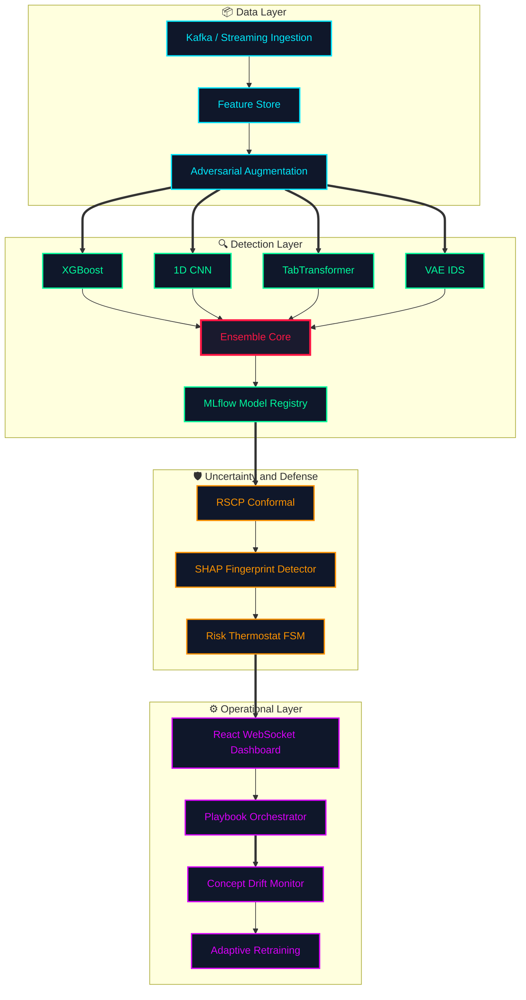

# Adversarially Resilient Detection Pipelines (ARDP)

A self-healing Security Operations Center (SOC) pipeline that combines adversarial
training, certified conformal prediction, SHAP-based adversarial detection, and
adaptive concept-drift handling to maintain robust, explainable intrusion detection
under active adversarial pressure.

---

## 🏗️ Architecture



## Quick Start

```bash
# 1. Install dependencies
pip install -r requirements.txt

# 2. Start the pipeline (demo mode — synthetic data)
python main_pipeline.py --mode demo

# 3. Launch the SOC dashboard
cd dashboard && npm install && npm run dev
# Dashboard: http://localhost:5173
# API:       http://localhost:8000/docs
```

---

## Installation

### Requirements
- Python 3.10+
- Node.js 18+ (for dashboard)

### pip (recommended)

```bash
python -m venv .venv
source .venv/bin/activate       # Windows: .venv\Scripts\activate
pip install -r requirements.txt
```

### Docker (full stack)

```bash
docker compose up --build
# Services: api (8000), dashboard (5173), kafka (9092), zookeeper (2181)
```

---

## Usage

### Running the pipeline on real data

```python
from src.data_infrastructure import DataInfrastructure
from src.models.deep_ensemble import DeepEnsemble
from src.conformal.rscp import RandomizedSmoothedCP
from src.drift.drift_detector import ConsensusDriftDetector

# Load and preprocess
di = DataInfrastructure()
X_train, y_train, X_cal, y_cal, X_test, y_test = di.load_cicids2018(
    path="data/raw/02-14-2018.csv"
)

# Train deep ensemble
ensemble = DeepEnsemble(input_dim=X_train.shape[1], n_members=4)
ensemble.fit(X_train, y_train)

# Calibrate RSCP+
cp = RandomizedSmoothedCP(alpha=0.05, sigma=0.1, ptt=True)
cp.calibrate(ensemble, X_cal, y_cal)

# Inference with certified sets
prediction_sets = cp.predict_set(ensemble, X_test)
```

### Running benchmarks

```bash
python experiments/benchmark_suite.py      # full robustness benchmark
python experiments/ablation_study.py       # component ablation
python experiments/baseline_comparison.py  # vs. baselines
python experiments/robustness_curves.py    # generate all plots
```

### Running tests

```bash
pytest tests/ -v --tb=short
```

### Building the paper

```bash
cd paper && make pdf
```

---

## Project Structure

```
Adversarially-resilient-detection-pipelines/
├── configs/                    # YAML experiment configs
├── dashboard/                  # React + Vite SOC dashboard
├── data/
│   ├── raw/                    # Place CIC-IDS2018 CSV here
│   └── processed/
├── docs/                       # Extended documentation
│   ├── architecture.md
│   ├── threat_model.md
│   ├── api_reference.md
│   ├── deployment_guide.md
│   ├── attack_catalog.md
│   └── contributing.md
├── experiments/
│   ├── benchmark_suite.py
│   ├── robustness_curves.py
│   ├── ablation_study.py
│   ├── baseline_comparison.py
│   └── results/
├── paper/
│   ├── main.tex
│   ├── references.bib
│   ├── figures/
│   ├── tables/
│   └── Makefile
├── src/
│   ├── api/                    # FastAPI server + WebSocket
│   ├── attacks/                # White-box, black-box, physical, poisoning, GAN
│   ├── conformal/              # RSCP+, multi-class CP, online CP
│   ├── drift/                  # ADWIN, Page-Hinkley, MMD drift detectors
│   ├── explainability/         # SHAP, LIME, adversarial detector, reports
│   ├── mlops/                  # MLflow tracker, model registry, monitoring
│   ├── models/                 # DeepEnsemble, TabTransformer, VAE-IDS, trainer
│   ├── streaming/              # Kafka consumer/producer, feature store
│   └── risk_management_engine.py
├── tests/
│   ├── test_attacks.py
│   ├── test_models.py
│   ├── test_conformal.py
│   ├── test_streaming.py
│   ├── test_explainability.py
│   └── test_integration.py
├── main_pipeline.py
├── simulation_engine.py
├── docker-compose.yml
├── Dockerfile
└── requirements.txt
```

---

## Attack Library

| Category | Attack | Key Reference |
|---|---|---|
| White-box | PGD (ℓ₂, ℓ∞), C&W L2, AutoAttack | Madry et al. 2018; Carlini & Wagner 2017 |
| Black-box | Boundary Attack, HopSkipJump, Transfer | Brendel et al. 2018; Chen et al. 2020 |
| Physical | Feature-Constrained Evasion, SlowDrip, Mimicry | — |
| Poisoning | Label Flip, Backdoor, Clean-Label, Calibration | Shafahi et al. 2018 |
| Generative | WGAN-GP adversarial flow generator | Arjovsky et al. 2017 |

---

## Defense Components

| Component | Method | Guarantee |
|---|---|---|
| Adversarial training | TRADES / PGD-AT / Free-AT | Empirical robustness |
| Conformal defense | RSCP+ with PTT | Certified coverage ≥ 1−α for ‖δ‖₂ ≤ r* |
| Adversarial detection | SHAP attribution fingerprinting | AUC ≥ 0.90 (CIC-IDS2018) |
| Drift recovery | ADWIN + Page-Hinkley + MMD consensus | ≤ N-epoch recovery time |

---

## API Reference

The FastAPI server exposes the following endpoints:

| Method | Endpoint | Description |
|---|---|---|
| GET | `/health` | Health check |
| POST | `/predict` | Single-flow inference (JSON body) |
| POST | `/predict/batch` | Batch inference |
| GET | `/metrics` | Pipeline performance metrics |
| GET | `/drift/status` | Current drift detector state |
| WebSocket | `/ws/alerts` | Real-time alert stream |

Full reference: [docs/api_reference.md](docs/api_reference.md)

---

## Citation

If you use this work, please cite:

```bibtex
@article{ardp2025,
  author  = {Author},
  title   = {Adversarially Resilient Detection Pipelines: Certified Conformal
             Defense with Self-Healing Concept Drift Adaptation},
  journal = {arXiv preprint},
  year    = {2025}
}
```

---

## License

MIT License. See `LICENSE` for details.

---

## Contributing

Please read [docs/contributing.md](docs/contributing.md) before opening a PR.
