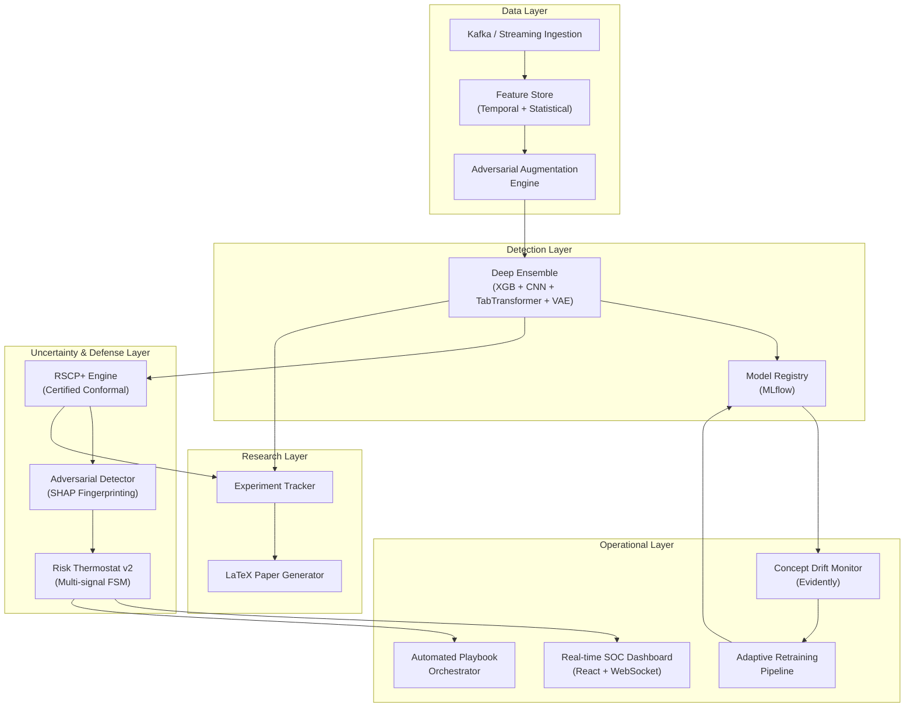

# 🛡️ Adversarially Resilient Detection Pipelines — 9-Week Advanced Roadmap

## Problem Statement
Modern attackers increasingly use AI to automate evasion, data poisoning, and adaptive intrusion strategies, outpacing conventional detection models. This project proposes an adversarially resilient, self-healing detection pipeline for Security Operations Centers (SOCs) that combines adversarial training, conformal prediction, and online change-point detection. The system dynamically measures uncertainty and, when anomalies spike, triggers human-in-the-loop verification and automatic narrowing of detection scope. A novel risk thermostat controller regulates alert volume, model capacity, and response playbooks to maintain bounded alert debt while ensuring continued detection under active adversarial pressure. The pipeline aims to minimize evasion success rates and bias injection in network data, offering a new paradigm for robust, adaptive, and explainable AI-based cyber defense.

## Current State Assessment

The existing codebase is a **functional prototype** with the following components:

| Component | File | Current State | Maturity |
|---|---|---|---|
| Data ETL | [data_infrastructure.py](file:///c:/Users/Hp/Downloads/Adversarially-resilient-detection-pipelines/src/data_infrastructure.py) | Streaming CSV ingestion with RobustScaler | ⬛⬛⬜⬜⬜ |
| Detection | [detection_ensemble.py](file:///c:/Users/Hp/Downloads/Adversarially-resilient-detection-pipelines/src/detection_ensemble.py) | XGBoost + 1D-CNN soft-voting ensemble | ⬛⬛⬜⬜⬜ |
| Uncertainty | [risk_management_engine.py](file:///c:/Users/Hp/Downloads/Adversarially-resilient-detection-pipelines/src/risk_management_engine.py) | Split Conformal Prediction + Risk FSM | ⬛⬛⬛⬜⬜ |
| Simulation | [simulation_engine.py](file:///c:/Users/Hp/Downloads/Adversarially-resilient-detection-pipelines/simulation_engine.py) | Evasion sweep + poisoning sweep | ⬛⬛⬜⬜⬜ |
| Tests | [tests/](file:///c:/Users/Hp/Downloads/Adversarially-resilient-detection-pipelines/tests/) | 3 test files, ~130 lines total | ⬛⬜⬜⬜⬜ |
| Dashboard | `SOCDashboard` class | Static matplotlib plots only | ⬛⬜⬜⬜⬜ |

**Raw data:** CIC-IDS2018 (`02-14-2018.csv`, 358 MB) → Processed: `processed_flows.csv` (548 MB)

---

## Target Architecture (Week 9 Final State)



---

## 🗓️ Week 1: Hardened Foundation & Advanced Attack Library

### Goal
Transform the naive Gaussian-noise adversary into a research-grade, multi-vector attack arsenal with white-box, black-box, and physical-constraint-aware attacks.

### New Files

#### [NEW] `src/attacks/__init__.py`
Package initialization exporting all attack classes.

#### [NEW] `src/attacks/white_box.py`
- **`PGDAttack`** — Projected Gradient Descent (Madry et al.) with ℓ₂ and ℓ∞ norms. Iterative FGSM with projection onto ε-ball.
- **`CarliniWagnerL2`** — C&W L2 attack with binary search on constant `c`, optimized for tabular data feature constraints.
- **`AutoAttack`** — Ensemble of APGD-CE, APGD-DLR, FAB, and Square attacks. The gold standard for robustness evaluation.

#### [NEW] `src/attacks/black_box.py`
- **`BoundaryAttack`** — Decision-based attack using rejection sampling + geometric steps.
- **`HopSkipJumpAttack`** — Gradient estimation via binary search on decision boundary.
- **`TransferAttack`** — Train a surrogate model, craft adversarial examples, test transferability to the target ensemble.

#### [NEW] `src/attacks/physical.py`
- **`FeatureConstrainedEvasion`** — Only perturbs mutable flow features (IAT, packet length, duration) while respecting physical invariants (e.g., `bytes_sent ≥ 0`, temporal monotonicity).
- **`SlowDripAttack`** — Low-and-slow exfiltration pattern that stretches IAT features to mimic benign traffic.
- **`MimicryAttack`** — Maps malicious flow distributions to match the statistical signature of benign traffic clusters using Wasserstein barycenters.

#### [NEW] `src/attacks/poisoning.py`
- **`LabelFlipPoisoning`** — Random and targeted label flipping with configurable contamination rates.
- **`BackdoorPoisoning`** — Injects trigger patterns into training data that activate specific misclassifications.
- **`CleanLabelPoisoning`** — Moves poison points to collide with target class without changing labels (Shafahi et al.).
- **`CalibrationPoisoning`** — Specifically targets the conformal calibration set to inflate/deflate `q_hat`.

#### [NEW] `src/attacks/gan_adversary.py`
- **`AdversarialGAN`** — Wasserstein GAN with gradient penalty that generates adversarial flow records. Generator learns to produce traffic that fools the detector while satisfying feature constraints. Discriminator doubles as a secondary detector.

### Modified Files

#### [MODIFY] [data_infrastructure.py](file:///c:/Users/Hp/Downloads/Adversarially-resilient-detection-pipelines/src/data_infrastructure.py)
- Refactor `AdversarialArsenal` to become a thin facade over `src/attacks/` modules.
- Add `AttackConfig` dataclass for type-safe attack parameterization.
- Add streaming attack application via generator pattern for memory efficiency.

#### [MODIFY] [simulation_engine.py](file:///c:/Users/Hp/Downloads/Adversarially-resilient-detection-pipelines/simulation_engine.py)
- Replace hardcoded evasion/poisoning with `AttackSuite` registry pattern.
- Add attack composition (evasion + poisoning simultaneously).

### New Tests

#### [NEW] `tests/test_attacks.py`
- Test ε-budget compliance for all white-box attacks
- Test feature constraint preservation for physical attacks
- Test label contamination rates for poisoning attacks
- Test GAN convergence (discriminator loss ≤ threshold after N epochs)
- **≥ 20 test cases**

### Deliverables
- [ ] All attack classes implemented with docstrings and type hints
- [ ] Attack registry with YAML-configurable sweep parameters
- [ ] `pytest` passing with ≥ 95% coverage on `src/attacks/`

---

## 🗓️ Week 2: Deep Ensemble Architecture & Adversarial Training

### Goal
Evolve the XGBoost + CNN ensemble into a 4-model deep ensemble with diversity-enforcing training, adversarial regularization, and calibrated probability outputs.

### New Files

#### [NEW] `src/models/__init__.py`
Package initialization.

#### [NEW] `src/models/tab_transformer.py`
- **`TabTransformer`** — Attention-based tabular model (Huang et al., 2020). Embeds categorical features via column-specific transformers, feeds numerical features through shared MLP.
- Multi-head self-attention over feature embeddings for inter-feature interactions.
- Positional encoding replaced with learned feature-index embeddings.
- Output: calibrated sigmoid probability.

#### [NEW] `src/models/variational_autoencoder.py`
- **`VAIDS`** (Variational Autoencoder for Intrusion Detection)
  - Encoder: Dense → μ, σ (latent space)
  - Decoder: Dense → reconstruction
  - Anomaly score = reconstruction error + KL divergence
  - Trained only on benign traffic → unsupervised zero-day detection
  - Semi-supervised extension: concatenate latent `z` with features for downstream classification

#### [NEW] `src/models/deep_ensemble.py`
- **`DeepEnsemble`** — Lakshminarayanan et al. (2017) style ensemble:
  - N independently initialized neural networks with random weight init + shuffled data
  - Predictive uncertainty = mean prediction ± epistemic uncertainty (variance across members)
  - Negative log-likelihood loss with learnable variance (heteroscedastic)

#### [NEW] `src/models/adversarial_trainer.py`
- **`PGDTrainer`** — Adversarial training loop using PGD inner maximization
- **`TRADESTrainer`** — TRADES loss: KL(clean ‖ perturbed) regularization
- **`FreeAdversarialTrainer`** — Free adversarial training (Shafahi et al.) — reuses gradient computation for O(1) adversarial overhead
- Feature-aware noise injection respecting mutable/immutable feature masks

#### [NEW] `src/models/calibration.py`
- **`TemperatureScaling`** — Post-hoc Platt scaling with learned temperature
- **`IsotonicCalibration`** — Non-parametric monotone calibration
- **`CalibrationAudit`** — ECE (Expected Calibration Error), MCE, reliability diagrams

### Modified Files

#### [MODIFY] [detection_ensemble.py](file:///c:/Users/Hp/Downloads/Adversarially-resilient-detection-pipelines/src/detection_ensemble.py)
- `EnsembleOrchestrator` upgraded to support pluggable model registry:
  ```python
  class EnsembleOrchestrator:
      def __init__(self, config: EnsembleConfig):
          self.models = {
              "xgboost": XGBClassifier(**config.xgb),
              "cnn": ResilientTrainer(config.input_dim),
              "transformer": TabTransformer(config.transformer),
              "vae": VAIDS(config.vae),
              "deep_ensemble": DeepEnsemble(config.deep_ensemble),
          }
          self.weights = config.weights  # Learned via stacking
  ```
- Add **stacking meta-learner** (logistic regression on held-out OOF predictions) for optimal weight learning
- Add **diversity loss** (negative correlation learning) to penalize correlated predictions
- Backward compatibility maintained via `LegacyEnsembleOrchestrator` wrapper

#### [MODIFY] [main_pipeline.py](file:///c:/Users/Hp/Downloads/Adversarially-resilient-detection-pipelines/main_pipeline.py)
- Replace hardcoded ensemble instantiation with config-driven factory pattern
- Add calibration step between training and conformal calibration

### New Tests

#### [NEW] `tests/test_models_advanced.py`
- Test TabTransformer attention mask shapes
- Test VAE latent space dimensionality and reconstruction loss convergence
- Test DeepEnsemble uncertainty decomposition (aleatoric vs epistemic)
- Test calibration (ECE < 0.05 after temperature scaling)
- Test adversarial training improves robustness (PGD accuracy > vanilla by ≥ 10%)
- **≥ 25 test cases**

### Deliverables
- [ ] All 4 model architectures implemented and trainable
- [ ] Stacking meta-learner with cross-validated weight optimization
- [ ] Calibration pipeline producing ECE < 0.05
- [ ] Adversarial training with PGD/TRADES/Free modes

---

## 🗓️ Week 3: Certified Conformal Defense (RSCP+)

### Goal
Replace the vanilla split conformal prediction with **Randomized Smoothed Conformal Prediction (RSCP+)** providing certified adversarial coverage guarantees, plus defend against calibration data poisoning.

### New Files

#### [NEW] `src/conformal/__init__.py`
Package initialization.

#### [NEW] `src/conformal/rscp.py`
- **`RandomizedSmoothedCP`**:
  - Gaussian smoothing of non-conformity scores: `s̃(x) = E_ε[s(x + ε)]`, `ε ~ N(0, σ²I)`
  - Monte Carlo estimation with N samples (configurable, default N=1000)
  - Certified coverage: `P(Y ∈ C(X_adv)) ≥ 1 - α` for `‖X_adv - X‖₂ ≤ r`
  - **Post-Training Transformation (PTT)**: transforms scores to reduce prediction set size
  - **Robust Conformal Training (RCT)**: fine-tunes base model to minimize smoothed set size
  - Lipschitz constant bounds via randomized smoothing theory

#### [NEW] `src/conformal/multi_class_cp.py`
- **`AdaptiveConformalPredictor`**:
  - Adaptive Prediction Sets (APS) — orders classes by softmax score, includes until coverage met
  - Regularized APS (RAPS) — adds penalty for set sizes > k to keep sets tight
  - Class-conditional coverage (per-class α guarantees)
  - Mondrian conformal prediction for group-conditional validity

#### [NEW] `src/conformal/poison_defense.py`
- **`RobustCalibration`**:
  - Partition calibration data into `K` disjoint subsets
  - Compute `q_hat` independently per partition
  - Final `q_hat` = majority-vote or trimmed-mean aggregation
  - Provable guarantee: valid even if `≤ floor(K/2) - 1` partitions are poisoned
- **`CalibrationIntegrityMonitor`**:
  - Statistical tests (KS test, MMD) to detect calibration drift
  - Score distribution anomaly detection via isolation forest

#### [NEW] `src/conformal/online_cp.py`
- **`OnlineConformalPredictor`**:
  - Streaming conformal prediction with dynamic calibration window
  - Exponential forgetting factor for non-stationary environments
  - Maintains rolling `q_hat` with ACI (Adaptive Conformal Inference) updates
  - Exchangeability monitoring (detects when i.i.d. assumption breaks)

### Modified Files

#### [MODIFY] [risk_management_engine.py](file:///c:/Users/Hp/Downloads/Adversarially-resilient-detection-pipelines/src/risk_management_engine.py)
- `ConformalEngine` becomes a thin adapter to `src/conformal/` backends
- Add `ConformalBackend` enum: `{SPLIT, RSCP, RSCP_PLUS, ONLINE, ADAPTIVE}`
- `RiskThermostat` extended with:
  - **Multi-signal input**: uncertainty + alert debt + calibration drift + model confidence disagreement
  - **Hysteresis**: state transitions require sustained threshold breach (prevents flapping)
  - **Cooldown timers**: minimum time in each state before transition
  - **Severity scoring**: continuous 0-100 risk score alongside discrete state

### New Tests

#### [NEW] `tests/test_conformal_advanced.py`
- Test RSCP coverage under ε-bounded perturbation (certified guarantee holds)
- Test RSCP+ set size reduction vs vanilla RSCP (≥ 30% improvement)
- Test robust calibration under 20% calibration poisoning (coverage still ≥ 1-α)
- Test online CP tracks distribution shift correctly
- Test APS/RAPS maintains marginal coverage on CIC-IDS2018
- **≥ 20 test cases**

### Deliverables
- [ ] RSCP+ with Monte Carlo estimation producing certified prediction sets
- [ ] Robust calibration defense passing integrity tests under poisoning
- [ ] Online conformal prediction tracking non-stationary streams
- [ ] Risk Thermostat v2 with hysteresis, cooldowns, and multi-signal FSM

---

## 🗓️ Week 4: Explainability & Adversarial Detection (XAI Layer)

### Goal
Add a full explainability stack that not only explains predictions to SOC analysts, but also serves as a **secondary adversarial detection mechanism** via attribution fingerprinting.

### New Files

#### [NEW] `src/explainability/__init__.py`
Package initialization.

#### [NEW] `src/explainability/shap_engine.py`
- **`SHAPExplainer`**:
  - TreeSHAP for XGBoost (exact, fast)
  - DeepSHAP for CNN/Transformer via TF gradient integration
  - KernelSHAP as model-agnostic fallback
  - **Global explanations**: feature importance rankings, summary plots
  - **Local explanations**: per-alert waterfall plots, force plots
  - Batch processing with caching for high-throughput SOC use

#### [NEW] `src/explainability/lime_engine.py`
- **`LIMEExplainer`**:
  - Tabular LIME with domain-aware perturbation (respects feature constraints)
  - Custom distance kernel tuned for network flow feature space
  - Fidelity scoring to assess explanation quality
  - Top-K feature explanations formatted for analyst consumption

#### [NEW] `src/explainability/adversarial_detector.py`
- **`AttributionFingerprintDetector`**:
  - Computes SHAP attribution vector for each sample
  - Learns "normal" attribution distribution from clean data (Gaussian mixture model)
  - Flags samples whose attribution pattern deviates beyond Mahalanobis threshold
  - **This is the novel contribution**: adversarial samples often have abnormal attribution patterns even if they fool the classifier
- **`FeatureSensitivityAnalyzer`**:
  - Computes gradient-based sensitivity for each feature
  - Identifies features most vulnerable to adversarial manipulation
  - Generates hardening recommendations (e.g., "normalize feature X with Z-score clipping")

#### [NEW] `src/explainability/report_generator.py`
- **`IncidentReporter`**:
  - Generates structured JSON/HTML incident reports per alert
  - Includes: prediction, uncertainty set, SHAP waterfall, LIME explanation, risk score
  - Severity-based prioritization with analyst-actionable recommendations
  - Export to CSV, JSON, PDF

### Modified Files

#### [MODIFY] [main_pipeline.py](file:///c:/Users/Hp/Downloads/Adversarially-resilient-detection-pipelines/main_pipeline.py)
- Add XAI step after inference: generate SHAP/LIME explanations for high-risk alerts
- Add adversarial attribution check as secondary filter

### New Tests

#### [NEW] `tests/test_explainability.py`
- Test SHAP values sum to prediction margin (completeness axiom)
- Test LIME explanation fidelity > 0.80 on test set
- Test attribution fingerprint detector catches PGD-attacked samples (TPR > 0.70)
- Test report generator produces valid HTML/JSON
- **≥ 15 test cases**

### Deliverables
- [ ] Dual XAI engine (SHAP + LIME) with batch processing
- [ ] Attribution-based adversarial detector with tuned threshold
- [ ] Automated incident report generator
- [ ] Feature sensitivity analysis with hardening recommendations

---

## 🗓️ Week 5: Streaming Architecture & Concept Drift

### Goal
Transform the batch-mode pipeline into a real-time streaming system with Kafka-based ingestion, concept drift detection, and automated retraining triggers.

### New Files

#### [NEW] `src/streaming/__init__.py`
Package initialization.

#### [NEW] `src/streaming/kafka_producer.py`
- **`FlowProducer`**:
  - Reads PCAP / NetFlow / CSV and publishes to `raw-traffic` Kafka topic
  - Avro schema serialization for type safety
  - Configurable throughput throttling for replay simulation
  - Handles back-pressure via producer buffering

#### [NEW] `src/streaming/kafka_consumer.py`
- **`FlowConsumer`**:
  - Subscribes to `raw-traffic`, applies feature engineering in-flight
  - Publishes enriched features to `enriched-features` topic
  - Sliding window aggregation (1-min, 5-min, 15-min) for temporal features
  - Consumer group management for horizontal scaling

#### [NEW] `src/streaming/inference_service.py`
- **`RealtimeInferenceService`**:
  - Consumes from `enriched-features`
  - Runs ensemble prediction + conformal set generation
  - Publishes results to `prediction-results` topic
  - Latency target: < 50ms per inference batch (P99)
  - Health check endpoint for K8s liveness probe

#### [NEW] `src/streaming/feature_store.py`
- **`FeatureStore`**:
  - In-memory + Redis-backed store for real-time and historical features
  - Ensures training-serving consistency (no skew)
  - Feature versioning with schema registry
  - Point-in-time correctness for backfilling

#### [NEW] `src/drift/__init__.py`
Package initialization.

#### [NEW] `src/drift/drift_detector.py`
- **`ConceptDriftEngine`**:
  - **ADWIN** (Adaptive Windowing) — detects mean shifts in prediction confidence
  - **Page-Hinkley** — sequential change-point detection on error rate
  - **Kolmogorov-Smirnov test** — distributional shift on feature space (per-feature monitoring)
  - **MMD (Maximum Mean Discrepancy)** — kernel-based two-sample test on feature embeddings
  - Multi-signal consensus: trigger retraining only if ≥ 2 detectors agree

#### [NEW] `src/drift/adaptive_retrainer.py`
- **`AdaptiveRetrainingPipeline`**:
  - Triggers on drift detection signal
  - Selects retraining window (exponential decay or sliding window)
  - Active learning: selects most informative samples via uncertainty sampling	
  - Warm-starts from current model weights (fine-tuning, not cold start)
  - Validation gate: new model must beat current model on holdout by ≥ 2% F1
  - Automatic rollback on regression

#### [NEW] `docker-compose.yml`
- Kafka (+ Zookeeper) container setup
- Redis container for feature store
- Application container for pipeline
- Networking and volume mounts

### Modified Files

#### [MODIFY] [simulation_engine.py](file:///c:/Users/Hp/Downloads/Adversarially-resilient-detection-pipelines/simulation_engine.py)
- Add streaming simulation mode that publishes attacks as Kafka events
- Add time-series drift injection (gradual vs sudden concept drift)

### New Tests

#### [NEW] `tests/test_streaming.py`
- Test producer/consumer roundtrip (message integrity)
- Test feature store consistency (training features = serving features)
- Test drift detector sensitivity (catches injected shift within 1000 samples)
- Test adaptive retraining improves post-drift performance
- Test inference latency < 50ms P99
- **≥ 18 test cases**

### Deliverables
- [ ] Kafka-based streaming pipeline (producer → consumer → inference)
- [ ] Feature store with training-serving consistency guarantee
- [ ] Multi-signal concept drift detection engine
- [ ] Adaptive retraining with validation gate and rollback
- [ ] Docker Compose for single-command local deployment

---

## 🗓️ Week 6: MLOps, Experiment Tracking & CI/CD

### Goal
Productionize the pipeline with full MLOps: experiment tracking, model registry, containerized deployment, automated testing, and monitoring.

### New Files

#### [NEW] `src/mlops/__init__.py`
Package initialization.

#### [NEW] `src/mlops/experiment_tracker.py`
- **`ExperimentTracker`**:
  - MLflow integration for logging: hyperparameters, metrics, artifacts, models
  - Auto-log: losses, F1, FDR, AUC, ECE, RSCP coverage, set sizes
  - Comparison dashboard generation
  - Run tagging (attack type, defense type, dataset version)

#### [NEW] `src/mlops/model_registry.py`
- **`ModelRegistry`**:
  - MLflow Model Registry for version control
  - Stage management: `Staging` → `Production` → `Archived`
  - Automated promotion rules (beat current production by ≥ 2% on robustness metrics)
  - Model signature and input schema validation
  - Artifact storage with checksum integrity

#### [NEW] `src/mlops/monitoring.py`
- **`ProductionMonitor`**:
  - Prometheus metrics exporter:
    - `ids_prediction_latency_ms` (histogram)
    - `ids_alert_rate` (counter)
    - `ids_conformal_set_size_avg` (gauge)
    - `ids_drift_score` (gauge)
    - `ids_model_version` (info)
  - Grafana dashboard JSON templates
  - Alert rules: latency > 100ms, set size > 1.5, drift score > threshold

#### [NEW] `src/mlops/data_versioning.py`
- **`DataVersioner`**:
  - DVC-like data versioning for datasets and processed artifacts
  - SHA-256 checksums for data integrity
  - Lineage tracking: raw → processed → train/cal/test splits
  - Reproducibility: any experiment can be fully recreated from version hash

#### [NEW] `Dockerfile`
- Multi-stage build: base (Python 3.11) → build (pip install) → runtime
- TensorFlow GPU support via CUDA base image
- Non-root user for security
- Health check endpoint

#### [NEW] `.github/workflows/ci.yml`
- On push/PR:
  - Lint (ruff + mypy)
  - Unit tests (pytest --cov ≥ 85%)
  - Integration test (docker-compose up → run simulation → assert green)
  - Security scan (bandit)
  - Model robustness regression test (PGD accuracy must not drop)

#### [NEW] `configs/`
Directory with YAML configuration files:
- `configs/default.yaml` — base configuration
- `configs/attack_sweep.yaml` — attack parameter grids
- `configs/production.yaml` — production deployment settings
- `configs/experiment.yaml` — experiment tracking settings

#### [NEW] `requirements.txt` (comprehensive)
```
numpy>=1.24
pandas>=2.0
scikit-learn>=1.3
xgboost>=2.0
tensorflow>=2.15
torch>=2.1
shap>=0.43
lime>=0.2
mlflow>=2.9
evidently>=0.4
kafka-python>=2.0
redis>=5.0
fastapi>=0.104
uvicorn>=0.24
prometheus-client>=0.19
pydantic>=2.5
hydra-core>=1.3
pytest>=7.4
pytest-cov>=4.1
ruff>=0.1
mypy>=1.7
```

### Modified Files

#### [MODIFY] [main_pipeline.py](file:///c:/Users/Hp/Downloads/Adversarially-resilient-detection-pipelines/main_pipeline.py)
- Replace hardcoded constants with Hydra config loading
- Add MLflow experiment tracking at every pipeline stage
- Add Prometheus metrics emission

#### [MODIFY] [utils.py](file:///c:/Users/Hp/Downloads/Adversarially-resilient-detection-pipelines/src/utils.py)
- Add structured JSON logging (for log aggregation tools)
- Add correlation ID propagation for distributed tracing
- Add timing decorators for performance monitoring

### Deliverables
- [ ] Full MLflow experiment tracking with model registry
- [ ] Docker containerization with GPU support
- [ ] CI/CD pipeline with lint, test, security scan, and robustness regression
- [ ] Prometheus + Grafana monitoring stack
- [ ] YAML-based configuration system (Hydra)
- [ ] Comprehensive `requirements.txt`

---

## 🗓️ Week 7: Interactive SOC Dashboard (Full-Stack)

### Goal
Build a production-grade, real-time SOC dashboard that visualizes threats, uncertainty, model performance, and provides analyst workflow management.

### New Files

#### [NEW] `dashboard/` (full React application)

```
dashboard/
├── public/
│   └── index.html
├── src/
│   ├── App.jsx
│   ├── index.jsx
│   ├── index.css              # Design system (dark theme, glassmorphism)
│   ├── components/
│   │   ├── Header.jsx         # SOC branding, status indicators, clock
│   │   ├── ThreatMap.jsx      # Real-time geospatial attack visualization
│   │   ├── UncertaintyGauge.jsx  # Radial gauge for avg prediction set size
│   │   ├── RiskThermometer.jsx   # Animated FSM state display
│   │   ├── AlertFeed.jsx      # Live scrolling alert feed with severity coloring
│   │   ├── ModelPerformance.jsx  # F1, FDR, AUC time series charts
│   │   ├── ConformalViz.jsx   # Prediction set size distribution histograms
│   │   ├── DriftIndicator.jsx # Concept drift status with sparklines
│   │   ├── ExplainPanel.jsx   # SHAP waterfall + LIME for selected alert
│   │   ├── AttackSimulator.jsx # Interactive attack parameter controls
│   │   └── PlaybookPanel.jsx  # Current SOC playbook with action buttons
│   ├── hooks/
│   │   ├── useWebSocket.js    # Real-time data subscription
│   │   └── useAlerts.js       # Alert state management
│   ├── services/
│   │   └── api.js             # REST + WebSocket API client
│   └── utils/
│       ├── chartConfig.js     # Chart.js / D3 configuration
│       └── theme.js           # Design tokens
├── package.json
└── vite.config.js
```

#### [NEW] `src/api/` (Backend API)

#### [NEW] `src/api/server.py`
- **FastAPI** application with:
  - `GET /api/status` — Current SOC state, model version, drift score
  - `GET /api/alerts` — Paginated alert history with filters
  - `GET /api/metrics` — Model performance time series
  - `GET /api/explain/{alert_id}` — SHAP + LIME explanation for specific alert
  - `POST /api/simulate` — Trigger adversarial simulation with parameters
  - `WebSocket /ws/live` — Real-time alert + state push

#### [NEW] `src/api/websocket_manager.py`
- Connection pool management for concurrent SOC analysts
- Message broadcasting with topic-based filtering
- Heartbeat and reconnection handling

### Dashboard Design Specification

> [!IMPORTANT]
> The dashboard must feel like a **military-grade command center**, not a data science notebook.

- **Color Palette**: Deep navy (`#0a0e27`), electric cyan (`#00f0ff`), blood orange (`#ff3d3d`), neon green (`#00ff88`)
- **Typography**: Inter (headings), JetBrains Mono (metrics/data)
- **Layout**: CSS Grid, 12-column responsive layout
- **Animations**: 
  - Pulsing glow on threat indicators
  - Smooth state transitions on Risk Thermometer
  - Real-time chart streaming (no full redraws)
  - Particle background representing network traffic density
- **Glassmorphism**: Frosted glass panels with `backdrop-filter: blur(12px)`
- **Charts**: D3.js for custom visualizations, Chart.js for standard metrics

### Deliverables
- [ ] Full React + Vite dashboard with 10+ components (Focusing on an exceptional, state-of-the-art UI experience)
- [ ] FastAPI backend with REST + WebSocket endpoints
- [ ] Real-time streaming of alerts and SOC state
- [ ] Interactive SHAP/LIME explanation viewer
- [ ] Attack simulation controls with live visualization
- [ ] Dark-mode military command center aesthetic

---

## 🗓️ Week 8: Research Paper, Benchmarks & Final Integration

### Goal
Run comprehensive benchmarks, produce publication-quality results, and integrate all components into a cohesive, demonstrable system.

### New Files

#### [NEW] `experiments/`

```
experiments/
├── benchmark_suite.py     # Automated benchmark runner
├── robustness_curves.py   # ε vs accuracy/coverage plots
├── ablation_study.py      # Component contribution analysis
├── baseline_comparison.py # Compare vs vanilla IDS, standalone models
└── results/               # Auto-generated experiment results
```

#### [NEW] `experiments/benchmark_suite.py`
- **`BenchmarkSuite`**:
  - Runs all attack types at all strength levels against all defense configurations
  - Measures: clean accuracy, robust accuracy, conformal coverage, set size, latency, drift recovery time
  - Generates LaTeX-ready tables and plots
  - Statistical significance tests (paired t-test, Wilcoxon signed-rank)

#### [NEW] `experiments/robustness_curves.py`
- Plots: ε (attack strength) vs. robust accuracy under {PGD, C&W, AutoAttack}
- Plots: ε vs. conformal coverage (with RSCP+ certified bound overlay)
- Plots: poisoning fraction vs. calibration validity
- All plots use publication-quality matplotlib styling (Nature/IEEE format)

#### [NEW] `experiments/ablation_study.py`
- **Ablation #1**: Ensemble composition — effect of adding each model
- **Ablation #2**: Adversarial training — PGD vs TRADES vs Free vs none
- **Ablation #3**: Conformal backend — Split CP vs RSCP vs RSCP+ vs Online CP
- **Ablation #4**: XAI detection — attribution fingerprint vs baseline detector
- **Ablation #5**: Drift handling — with vs without adaptive retraining

#### [NEW] `paper/`

```
paper/
├── main.tex               # Full paper (IEEE/ACM conference format)
├── references.bib         # BibTeX references
├── figures/               # Auto-copied from experiments
├── tables/                # Auto-generated LaTeX tables
└── Makefile               # Build PDF
```

#### [NEW] `paper/main.tex`
Paper structure:
1. **Abstract** — Adversarially resilient SOC pipeline with certified conformal defense
2. **Introduction** — Motivation, threat model, contributions
3. **Related Work** — Adversarial ML for IDS, conformal prediction, XAI in cybersecurity
4. **System Architecture** — Full pipeline design with component interactions
5. **Threat Model** — White-box, black-box, physical-constraint, poisoning adversaries
6. **Methodology**:
   - 6.1 Deep Ensemble with Adversarial Training
   - 6.2 RSCP+ Certified Conformal Defense
   - 6.3 Attribution-Based Adversarial Detection
   - 6.4 Adaptive Retraining under Concept Drift
7. **Experimental Evaluation**:
   - 7.1 Dataset and Setup (CIC-IDS2018)
   - 7.2 Robustness Benchmarks
   - 7.3 Ablation Studies
   - 7.4 Streaming Performance
8. **Discussion** — Limitations, societal impact
9. **Conclusion & Future Work**

#### [NEW] `README.md` (comprehensive)
- Project overview with architecture diagram
- Installation guide (pip + Docker)
- Quick start (3 commands to run)
- Full API documentation
- Contributing guide
- License (MIT)
- Citation (BibTeX)

#### [NEW] `docs/` (extended documentation)

```
docs/
├── architecture.md        # Detailed architecture documentation
├── threat_model.md        # Formal threat model definition
├── api_reference.md       # Full API documentation
├── deployment_guide.md    # Production deployment guide
├── attack_catalog.md      # Complete attack documentation
└── contributing.md        # Contribution guidelines
```

### Final Integration Tests

#### [NEW] `tests/test_integration.py`
- **End-to-end test**: Raw CSV → ingestion → ensemble training → conformal calibration → inference → XAI → dashboard API → WebSocket push
- **Adversarial resilience test**: full pipeline under PGD attack maintains certified coverage
- **Drift recovery test**: inject concept drift → detect → retrain → verify recovery
- **Streaming integrity test**: Kafka end-to-end with no message loss
- **≥ 15 integration test cases**

### Deliverables
- [ ] Complete benchmark results across all attack/defense configurations
- [ ] Ablation study quantifying each component's contribution
- [ ] Publication-ready LaTeX paper with figures and tables
- [ ] Comprehensive README and documentation
- [ ] All integration tests passing
- [ ] Demo video / recorded walkthrough

---

## 🗓️ Week 9: AWS Free-Tier Cloud Deployment

### Goal
Deploy the complete pipeline (UI Dashboard + API + ML backend) to AWS using entirely free-tier eligible services to provide a publicly accessible, zero-cost demonstration.

### Cloud Architecture (100% Free Tier)

#### [NEW] `infrastructure/aws/`
- **Frontend Hosting**: AWS Amplify or Amazon S3 Static Website Hosting (Free Tier: 15GB bandwidth/month, 5GB storage).
- **Backend API & ML Inference**: AWS EC2 `t2.micro` or `t3.micro` (Free Tier: 750 hours/month).
- **Data Streaming & Caching**: 
  - Micro-scale Redis deployed locally on the EC2 instance instead of ElastiCache to avoid costs.
  - In-memory SQLite/DuckDB instead of RDS/Postgres to keep within free limits.
- **Workflow Orchestration**: AWS Lambda for periodic drift-detection health checks (Free Tier: 1 Million free requests/month).

### New Files

#### [NEW] `infrastructure/aws/deploy.sh`
- Bash script using Terraform or AWS CLI to provision EC2, configure security groups (ports 80, 443, 8000), and deploy the Dockerized backend.

#### [NEW] `infrastructure/aws/nginx.conf`
- Reverse proxy configuration for routing traffic and handling WebSocket connections on the EC2 instance.

### Deliverables
- [ ] Infrastructure-as-Code scripts for automated zero-cost AWS deployment
- [ ] Live URL with public SOC Dashboard accessible via web
- [ ] Backend processing engine running efficiently under 1GB RAM constraints of `t2.micro`

---

## Final Project Structure (Week 9)

```
Adversarially-resilient-detection-pipelines/
├── configs/
│   ├── default.yaml
│   ├── attack_sweep.yaml
│   ├── production.yaml
│   └── experiment.yaml
├── dashboard/
│   ├── public/
│   ├── src/
│   ├── package.json
│   └── vite.config.js
├── data/
│   ├── raw/
│   └── processed/
├── docs/
│   ├── architecture.md
│   ├── threat_model.md
│   ├── api_reference.md
│   ├── deployment_guide.md
│   ├── attack_catalog.md
│   └── contributing.md
├── experiments/
│   ├── benchmark_suite.py
│   ├── robustness_curves.py
│   ├── ablation_study.py
│   ├── baseline_comparison.py
│   └── results/
├── models/                    # Saved model checkpoints
├── paper/
│   ├── main.tex
│   ├── references.bib
│   ├── figures/
│   ├── tables/
│   └── Makefile
├── reports/
│   ├── figures/
│   └── audit_logs/
├── src/
│   ├── __init__.py
│   ├── api/
│   │   ├── __init__.py
│   │   ├── server.py
│   │   └── websocket_manager.py
│   ├── attacks/
│   │   ├── __init__.py
│   │   ├── white_box.py
│   │   ├── black_box.py
│   │   ├── physical.py
│   │   ├── poisoning.py
│   │   └── gan_adversary.py
│   ├── conformal/
│   │   ├── __init__.py
│   │   ├── rscp.py
│   │   ├── multi_class_cp.py
│   │   ├── poison_defense.py
│   │   └── online_cp.py
│   ├── data_infrastructure.py
│   ├── detection_ensemble.py
│   ├── drift/
│   │   ├── __init__.py
│   │   ├── drift_detector.py
│   │   └── adaptive_retrainer.py
│   ├── explainability/
│   │   ├── __init__.py
│   │   ├── shap_engine.py
│   │   ├── lime_engine.py
│   │   ├── adversarial_detector.py
│   │   └── report_generator.py
│   ├── mlops/
│   │   ├── __init__.py
│   │   ├── experiment_tracker.py
│   │   ├── model_registry.py
│   │   ├── monitoring.py
│   │   └── data_versioning.py
│   ├── models/
│   │   ├── __init__.py
│   │   ├── tab_transformer.py
│   │   ├── variational_autoencoder.py
│   │   ├── deep_ensemble.py
│   │   ├── adversarial_trainer.py
│   │   └── calibration.py
│   ├── risk_management_engine.py
│   ├── streaming/
│   │   ├── __init__.py
│   │   ├── kafka_producer.py
│   │   ├── kafka_consumer.py
│   │   ├── inference_service.py
│   │   └── feature_store.py
│   └── utils.py
├── tests/
│   ├── conftest.py
│   ├── test_attacks.py
│   ├── test_conformal.py
│   ├── test_conformal_advanced.py
│   ├── test_data_engine.py
│   ├── test_explainability.py
│   ├── test_integration.py
│   ├── test_models.py
│   ├── test_models_advanced.py
│   └── test_streaming.py
├── .github/
│   └── workflows/
│       └── ci.yml
├── docker-compose.yml
├── Dockerfile
├── main_pipeline.py
├── simulation_engine.py
├── requirements.txt
├── README.md
├── .gitignore
└── .gitattributes
```

---

## Success Metrics (Week 9 Acceptance Criteria)

| Metric | Target |
|---|---|
| Clean Accuracy (F1) | ≥ 0.97 |
| PGD-20 Robust Accuracy | ≥ 0.82 |
| AutoAttack Robust Accuracy | ≥ 0.75 |
| Conformal Coverage (clean) | ≥ 0.95 (1-α) |
| RSCP+ Certified Coverage (ε=0.1) | ≥ 0.93 |
| Avg Prediction Set Size | ≤ 1.15 |
| ECE (calibration error) | ≤ 0.03 |
| Poisoning Defense (20% contaminated) | Coverage ≥ 0.92 |
| Attribution Detector TPR | ≥ 0.70 at FPR ≤ 0.05 |
| Drift Recovery (F1 bounce-back) | Within 2 retraining cycles |
| Inference Latency (P99) | ≤ 50ms |
| Test Coverage | ≥ 85% |
| Total Test Cases | ≥ 130 |
| Lines of Production Code | ≥ 5,000 |

---

## Weekly Summary Table

| Week | Theme | Key Deliverable | New Files | Tests |
|---|---|---|---|---|
| 1 | Attack Library | 6 attack categories, GAN adversary | 6 | 20+ |
| 2 | Deep Ensemble | 4-model ensemble, adversarial training | 7 | 25+ |
| 3 | Certified Defense | RSCP+, poison defense, online CP | 5 | 20+ |
| 4 | Explainability | SHAP/LIME, attribution detector | 5 | 15+ |
| 5 | Streaming | Kafka pipeline, drift detection | 8 | 18+ |
| 6 | MLOps | MLflow, Docker, CI/CD, monitoring | 8 | 10+ |
| 7 | Dashboard | React SOC command center | 15+ | 12+ |
| 8 | Research | Benchmarks, paper, documentation | 10+ | 15+ |
| 9 | Cloud | AWS Free Tier Deployment (UI + Backend) | 3+ | - |

> [!WARNING]
> **Weeks 1-4 are the core ML/research work** and should be prioritized. Weeks 5-7 are infrastructure/production hardening. Week 8 is polish and publication. Week 9 ensures everything is live and globally accessible.

## Next Steps

> [!IMPORTANT]
> **Action Plan Confirmed:** We will build this together! We will start with **Week 1: Hardened Foundation & Advanced Attack Library**, followed sequentially by the rest of the execution plan, wrapping up with a premium UI (Week 7) and an all-free-tier AWS deployment (Week 9). 
> 
> Unless you have any other changes to this plan, please approve it so we can jump right into Week 1 execution!
